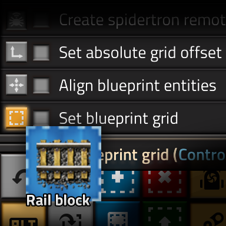

Factorio blueprint aligner mod
===

This is a small mod intended to help set blueprint grid size and offsets
by drawing the grid and placing the blueprint in the world.

Mod portal: https://mods.factorio.com/mod/blueprint-align

Usage
---

The mod adds three toolbar shortcuts:

- **Set blueprint grid**

  Activate while holding a blueprint,
  then select the area you would like to be one cell of the blueprint grid.
  The grid size and offset will be set on the blueprint.

- **Align blueprint entities**

  Activate while holding a blueprint with an alignment grid set,
  then place the blueprint in the world.
  The entities in the blueprint will be moved within the alignment grid
  to match the selected location.

- **Set blueprint grid offset**

  Activate while holding a blueprint with an alignment grid set,
  then place the blueprint in the world.
  The absolute grid offset of the blueprint will be set to match the selected location.

Demo video (v1.0): https://www.youtube.com/watch?v=45pQEFdYXsg

All shortcuts have hotkeys, which can be changed in the control settings.

The mod will by default print interaction feedback to the console to guide new users.
This can be turned off in the mod settings.

Caveats
---

- The "Align blueprint entities" and "Set blueprint grid offset" actions
  will initially set the blueprint to relative grid alignment.
  If you cancel the alignment by some method other than using the "clear cursor" keyboard shortcut,
  the previous absolute grid offset might not be restored.

License
---

This is free and unencumbered software released into the public domain.
For more information, please refer to [http://unlicense.org]().

Graphics assets are licensed under a
[Creative Commons Attribution-ShareAlike 4.0 International License](http://creativecommons.org/licenses/by-sa/4.0/).
